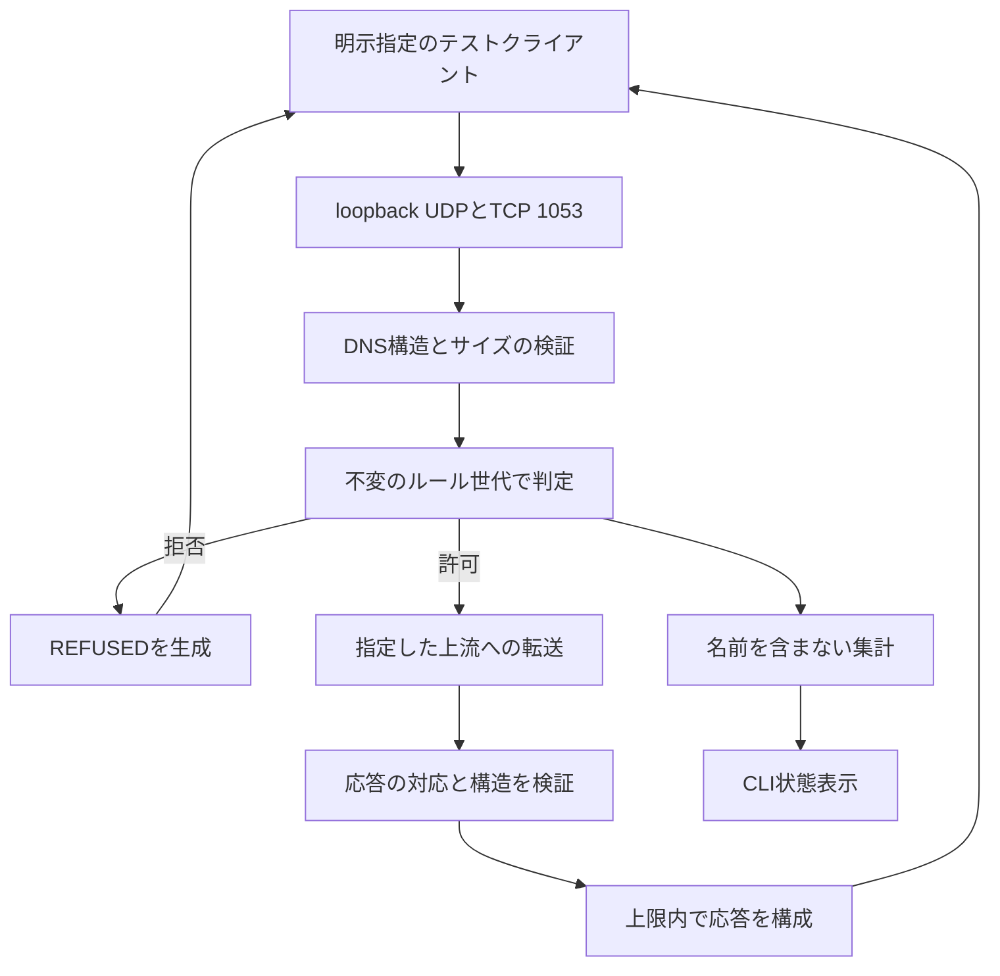
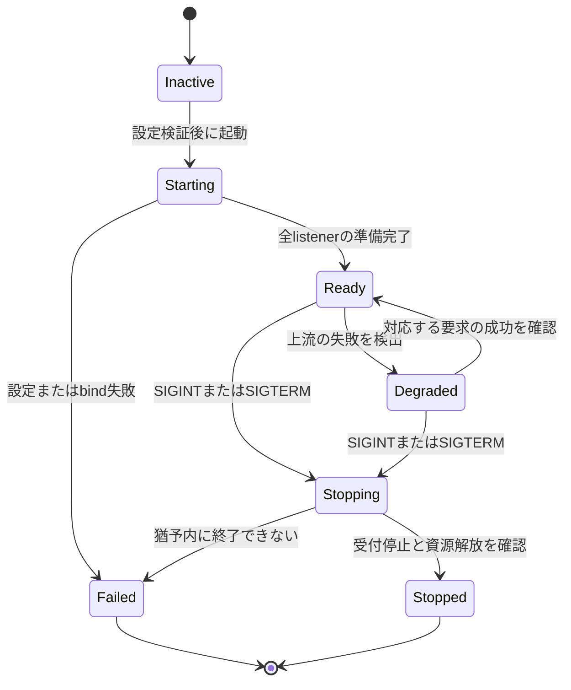

# veil-blackhole の設計

現行の作業範囲は、後続の指定により[Phase 1の読み取り専用DNSアナライザ](PHASE1_DESIGN.md)へ絞られた。本文はDNSフィルタリングを選ぶ場合の比較案として保持する。ここにあるDNSサーバー、応答合成、送信研究、OS統合の段階は、Phase 1の実装対象ではない。

作成日：2026年10月6日 JST。状態：実装判断のための設計案。実装開始、OS設定変更、実通信の観測・送信、配布は別途判断する。

`veil-blackhole` は、利用者が選んだDNS経路に対して、ローカルのドメインルールで問い合わせを許可・拒否するmacOS向けツールを目指す。**BPFで問い合わせのコピーを読み、偽応答を先着させる方式は、通信を確実に制御する製品の基盤には採用しない。** 最小の検証は、OS設定を変えない明示指定のローカルDNSサーバーとする。Mac全体への適用が必要だと確認できた場合に、AppleのDNS Proxyを使う方式を評価する。

本文の「必須」「禁止」はこの設計案における実装条件を表す。規格上の要件はリンク先の一次資料と区別する。初期値は資源を有限にするための提案であり、測定済みの性能値や製品の合格基準ではない。

## 1 提示案の訂正

| 提示案 | 訂正と設計への影響 |
| --- | --- |
| NICは100%絶対に壊れない | BPFは通常、フレームの読み書きを行うOSの機構であり、電圧やNICファームウェアを書き換える操作とは異なる。これから全機種・全ドライバーの無故障を証明することはできない。可用性、カーネルやドライバーの不具合、送信先への影響を含めて扱う。 |
| 不正なパケットは必ずOSが捨てる | BPFの送信経路にはrawのリンク層出力がある。通常の高水準ソケットと同じ検証・制約があるとは仮定しない。研究でも生成側が長さ・構造・宛先を検証する。 |
| 最悪でも再起動だけ | クラッシュ前の未保存データの喪失、DNS障害、機密ドメインの漏洩、他端末への誤送信なども失敗条件になる。「最悪」を限定しない。 |
| BPFでDNSを傍受すれば遮断できる | BPFのキャプチャフィルターは、キャプチャへ渡すデータの選別である。そこで見なかったパケットがOSやネットワークから消えるわけではない。 |
| MAC/IPを反転して書けば自身へ応答できる | 物理NICの送信経路から出したフレームが、自身のIP入力へ届くとは限らない。L2のMACは通常隣接ノードのものであり、遠方のDNSサーバーのMACではない。受理までを独立した実験で確かめる必要がある。 |
| 1ナノ秒で応答 | 根拠のある実測値ではない。I/O、待機、解析、ルール判定、応答生成、配送を含む遅延を測る。 |
| pnetにはlibpcapが必須 | 調査した0.35.0では、macOSの標準バックエンドはBPFで、`pcap` は任意依存である。libpcapを使う別構成を選んだときに検討する。 |
| BPFは必ず同期ブロッキング | BPFの待機方法は構成次第。pnet 0.35.0は非ブロッキングFDと`pselect`を使い、公開受信APIは同期的に待機する。非同期UIとの分離は妥当だが唯一の構成ではない。 |
| Nixなら全環境が完璧に一致する | Flakeの入力固定は有用だが、OS、カーネル、NIC、AppleのSDK、署名・権限、ネットワーク条件は別途管理する。 |
| 常にen0を使う | インターフェース名だけで役割を決めない。VPN、USB Ethernet、複数経路、IPv6、loopbackを考慮する。研究で使うものは明示選択する。 |
| 127.0.0.1は無害なブラックホール | そのポートで動くローカルサービスへ接続する可能性がある。AAAAなども扱う必要があり、Aだけ書き換えても十分ではない。初版はアドレスを合成しない。 |
| DNSシンクホールがDLP・ゼロトラストになる | DNSを通らない接続、既存接続、許可先への送信などを止められない。ドメインフィルタリングとして説明する。 |
| sudo cargo runが適切 | ビルドスクリプトや依存コードをrootで走らせない。ビルドは一般ユーザーで行い、必要な能力だけを実行時に与える。 |

BPFの取得・出力の区別は、[Apple XNUのbpf.c](https://github.com/apple-oss-distributions/xnu/blob/f6217f891ac0bb64f3d375211650a4c1ff8ca1ea/bsd/net/bpf.c)の`bpf_tap_imp`と`bpfwrite`、および調査端末の`man 4 bpf`に基づく。公開XNUの当該コミットが、調査端末のカーネルと同一であるとは扱わない。自端末での受理不能を全条件に一般化するのも不適切であり、到達・受理を未証明と扱う。

pnetの依存とmacOSバックエンドは、[0.35.0のCargo.toml](https://docs.rs/crate/pnet_datalink/0.35.0/source/Cargo.toml)、[バックエンド選択](https://github.com/libpnet/libpnet/blob/v0.35.0/pnet_datalink/src/lib.rs)、[BPF実装](https://github.com/libpnet/libpnet/blob/v0.35.0/pnet_datalink/src/bpf.rs)で確認した。別バージョンへ変更するときは再確認する。

DNSシンクホールのみでは、主体や端末の認証・認可、リソース単位のアクセス制御を備えたゼロトラストアーキテクチャにはならない。[NIST SP 800-207](https://csrc.nist.gov/pubs/sp/800/207/final)

## 2 目的と製品価値

初期利用者は、MacでDNSルールの影響を理解したい開発者・セキュリティ担当者とする。成功は「何を拒否したかと理由が分かり、許可した名前は解決でき、停止によって意図した状態へ戻せること」とする。拒否件数の多さだけを価値指標にしない。

既存代替として、ドメインルールを持つDNSサーバーを利用する方法がある。例えば[AdGuard Home](https://github.com/AdguardTeam/AdGuardHome)はDNSベースの広告・トラッカーのフィルタリングを提供している。基本的なドメイン拒否だけが目的なら、新規実装を始めず既存ツールを使う案を優先する。

新規開発の価値仮説は、Macでの有効・無効の切替、ルールの理由の説明、プライバシーを保った診断、障害時の復旧が既存代替より分かりやすいことに置く。利用者による比較なしに、BtoB需要、支払意思、収益性があるとは判断しない。

| 判断 | 次へ進む条件 | 止める条件 |
| --- | --- | --- |
| 学習・研究として実施 | BPFの到達・競合、DNS解析など、検証したい問いを一つに絞れる | 同じ実験を新しい仮説なしに繰り返す必要が出る |
| 最小の製品検証 | 既存代替で困る具体的な利用場面があり、許可・拒否・停止を試せる | 基本機能の複製だけで、解決する不便が見つからない |
| Mac全体への適用 | 明示指定のDNSだけでは利用目的を満たさず、配布・復旧の負担を引き受ける判断がある | 強制遮断やDLP保証が必須で、この製品の範囲では満たせない |
| 継続投資 | 現在の主力プロダクトへの影響と、得られる販売・研究成果を比較できる | 技術的な面白さだけで主力のリリース・販売を遅らせる |

この設計案は`veil-blackhole`を新たなP0へ昇格させない。開発時間の上限と現在の主目的は、実装開始時に決める。既存の`veil-warden`などへ組み込む判断も含まない。

## 3 対象範囲と要件

| ID | 必須の振る舞い | 確認方法 |
| --- | --- | --- |
| R01 | 初期検証はloopbackの高位ポートだけで動く。OSのDNS、PF、経路、常駐設定を変えない | 設定差分、listen先、権限を確認 |
| R02 | ルールで拒否したQNAMEを上流へ送信しない | 上流スタブの受信記録が0であることを確認 |
| R03 | 許可した標準QUERYを指定上流へ転送し、対応する応答だけを返す | 正常・偽応答・遅延応答の試験 |
| R04 | ドメイン境界、大文字小文字、末尾root labelを一貫して扱う | ルール表の境界試験 |
| R05 | UDPとTCP、IPv4とIPv6のDNS経路を扱う | 各transportの統合試験 |
| R06 | 入力、同時要求、待機時間、メモリ、ログを有限にする | 異常入力、飽和、低速クライアントの試験 |
| R07 | 設定の失敗で有効なルールを失わず、各要求は一つのルール世代で判定する | 不正reloadと同時処理の試験 |
| R08 | 既定でQNAME、パケット、送信元情報を永続保存しない | ログ・ファイルの点検 |
| R09 | 停止・失敗・無効状態を利用者が区別できる | CLIの終了コード、状態表示、復旧試験 |
| R10 | 観測成功、DNS拒否、通信遮断を別の結果として表示する | 表示・報告のレビュー |

初期の対象外は、LANの他端末、アプリ別制御、HTTP URLや送信内容の検査、TLS復号、DLP、マルウェア検知、既存接続の切断、永続的な強制遮断、自動ルール取得、遠隔管理、課金・公開である。

DoH・DoT、独自の名前解決、固定IP、既存のDNSキャッシュ、VPN内の別経路、mDNSのUDP 5353は初期の適用範囲外とする。DNS Proxyを採用しても、独自のHTTPS通信がDNS問い合わせかどうかを一般に判断する能力が得られるとは考えない。[DoH RFC 8484](https://www.rfc-editor.org/rfc/rfc8484.html)、[DoT RFC 7858](https://www.rfc-editor.org/rfc/rfc7858.html)

## 4 実現方式の比較

| 方式 | 制御できるもの | 制約と運用負担 | この設計案の位置づけ |
| --- | --- | --- | --- |
| BPFでコピーを読み、偽応答を送信 | 取得できる平文DNSの観測、フレーム生成・送信 | 元要求を止めない。自端末への配送、受理、正規応答との競合が未解決 | 製品経路から外し、任意の研究とする |
| 明示指定のローカルDNSサーバー | そのサーバーへ届く問い合わせの応答と上流転送 | OS全体には自動適用されない。高位ポートは通常のOS DNS設定の置換ではない | 最小の検証として推奨 |
| OSのDNSをローカル53番へ変更 | 変更したresolver経路の問い合わせ | rootや常駐、元設定の復元、VPN・分割DNSとの競合が必要 | 初期案では採用しない |
| Network ExtensionのDNS Proxy | Providerへ渡されるDNSフロー | Swift側のライフサイクル、System Extension、署名・entitlement、承認・配布が必要 | Mac全体への適用候補として推奨 |
| PFでDNSをredirect/drop | PFに入る対象パケット | system serviceや他製品のルールと競合。製品向けAPIではない | 配布製品の基盤に採用しない |
| Content FilterやTransparent Proxy | 各Providerに渡される接続・パケット | ドメインだけのDNS制御を超える別設計と検証が必要 | 強制制御が必要なら目的を再定義して比較 |

AppleはDNS傍受用途にDNS Proxyを案内し、PFを広く配布するソフトウェアで利用しないよう説明している。[TN3165](https://developer.apple.com/documentation/technotes/tn3165-packet-filter-is-not-api)の対象は`/dev/pf`や`pfctl`を使うPFであり、BPFと同じ機構ではない。

macOSのDNS ProxyはSystem Extensionとして配布する形が示されている。[TN3134](https://developer.apple.com/documentation/technotes/tn3134-network-extension-provider-deployment)にある最低OSはAPIの利用条件であり、このプロジェクトの対応・検証済みOSの宣言ではない。

## 5 初期アーキテクチャ

最初は単一のRustパッケージで、pureなルール処理とDNS I/Oをモジュールで分ける。汎用バックエンド体系やworkspace分割を先に作らない。BPF研究の送信機能は通常の実行バイナリへ入れない。



| モジュール案 | 責務 | 持たせない責務 |
| --- | --- | --- |
| `main.rs` | CLI入力、起動・停止、終了コード | DNSのwire解析、rootでのビルド |
| `config.rs` | 設定の構造・意味・資源上限の検証 | OS設定の変更、上流の自動発見 |
| `policy.rs` | ラベル単位の正規化、allow/block判定、世代管理 | ネットワークI/O、パケットログ |
| `dns.rs` | DNS query/responseの検証とローカル拒否応答 | EthernetやIPの生成 |
| `server.rs` | UDP/TCP listener、受付上限、期限、要求ライフサイクル | TUI、設定ファイルの直接書換え |
| `upstream.rs` | 上流への転送、照合、TCP fallback、期限 | OS resolverを使った自己再帰、ルール判定 |
| `metrics.rs` | boundedな集計・イベントと欠落数 | QNAMEごとの無制限map、秘密情報の記録 |
| `research/decode.rs` | syntheticデータのL2/L3/L4解析 | OS全体の保護宣言 |
| `research/forge.rs` | 検証済みsynthetic入力から応答フレームを生成 | 実NICへ自動送信 |

TokioはDNSのUDP/TCP I/Oと有限のタスク管理に使う。ログ表示を理由にTUIを先行実装しない。通常のCLIで、listen先、有効ルール数、処理結果、失敗理由、停止状態を確認できれば初期検証には十分とする。

### 5.1 所有と並行処理

各受付要求は、client endpointまたはTCP connection、元ID、question、transport、deadline、取得済みルール世代を所有する。借用した受信バッファをawaitや別スレッドへ持ち越さない。必要なデータだけを上限付きで所有し、処理後に解放する。

同時要求数はsemaphore等で制限する。受付上限を確認してからタスクを作り、無制限の`spawn`をしない。クライアントの切断、期限、停止で上流待機を中止し、要求表を必ず解放する。DNS処理はUIやログの遅さで停止させない。

設定のreloadは、全体のparse・意味検証・コンパイルに成功した新しい`Arc<PolicySnapshot>`を一度に公開する。実行中の要求は旧snapshotを最後まで使う。不正reloadは旧世代を維持し、部分適用しない。初版のreload対象はドメインルールだけとし、listen先・上流・資源上限の変更は停止して再起動する。

### 5.2 資源上限の初期案

| 対象 | 検証用の初期案 | 上限時の挙動 |
| --- | --- | --- |
| 同時DNS要求 | 全体128件 | 小さいSERVFAILを返せる入力だけ返す。送信予算も超える場合はdropし集計 |
| TCP接続 | 全体32本、各接続の処理中要求は1件 | 余剰接続を終了。要求IDの衝突や順序逆転を避ける |
| 要求の総期限 | 2秒 | 上流失敗をSERVFAILとして返す。内部の無期限retryは禁止 |
| TCPのframe読取り | 1 frameあたり2秒、idle 5秒 | prefixだけ送る低速接続を終了。接続全体のidleと区別 |
| UDP応答サイズ | EDNSなし512 bytes、ありは最大1232 bytes | clientの値と実装上限の小さい方へ収める。必要ならTCを立てる |
| DNS message受信 | wire message最大65535 bytes。UDPの実payload上限も守る | oversize、切詰め受信、長さ不一致を拒否。短いbufferで正常と誤認しない |
| ルールファイル | 最大1 MiB、10000件 | 起動・reloadを失敗させる |
| UI向けイベント | 最大256件 | 古いイベントから破棄し、欠落数を表示 |
| 終了の猶予 | 3秒 | 残要求をcancel。終了できなければ失敗として報告 |

これらはloopback検証を小さく保つための暫定値であり、速さや安全性を証明する数値ではない。load試験のメモリ上限と要求遅延を見て調整する。UDP 1232 bytesも全ネットワークで断片化しない保証ではない。公衆DNSへの転送や製品のSLOには、その環境に応じた別の測定・判断が必要になる。

## 6 DNS処理契約

### 6.1 入力検証と対応範囲

DNSはライブラリで構造を検証し、外部データを信用しない。ヘッダー、section count、label長、展開後の名前長、compression pointer、RDLENGTH、message境界を確認する。pointerの循環・範囲外参照・過剰な展開でメモリやCPUを消費させない。[RFC 1035](https://www.rfc-editor.org/rfc/rfc1035.html)、[RFC 9267](https://www.rfc-editor.org/rfc/rfc9267.html)

| 入力 | 初版の処理 |
| --- | --- |
| QR=0、OPCODE=QUERY、QDCOUNT=1、QCLASS=IN | 対応する標準queryとして処理 |
| A、AAAA、TXT、MX、PTR、HTTPS、SVCBなど | QNAMEを同じルールで判定。許可時はaddress RRだけに限定せず転送 |
| ANY | QNAMEを判定し、許可時は指定上流の応答方針に従う。独自に巨大応答を生成しない |
| QUERY以外 | 安全に応答ヘッダーを生成できればNOTIMP。上流へ送らない |
| QDCOUNTが0または複数 | FORMERR。複数questionの一部だけを評価しない |
| IN以外のclass、AXFR/IXFR、TSIG付き要求 | 初版ではREFUSED。transferや認証付きmessageの改変を提供しない |
| QR=1として受付listenerへ来るmessage | 要求ではないためdrop |
| 壊れたmessage | 元ID等を安全に読める場合だけ最小FORMERR。それ以外はdrop。応答ループを作らない |
| EDNS version 0 | 最大一つのOPTを認め、サイズ・DOと構造を検証 |
| 未対応EDNS version | BADVERSを正しいextended RCODEとOPTで返す |

EDNSの処理は[ RFC 6891](https://www.rfc-editor.org/rfc/rfc6891.html)に従う。未知optionを理由なくmessage全体の異常と決めない。ローカル拒否応答には未知optionを反射しない。許可時のmessage転送は元のwire構造を可能な限り保ち、EDNSや未知RRのlosslessな扱いを候補ライブラリと統合試験で確認する。

初版の通常queryではAnswer/Authorityは空、AdditionalはOPTだけを許す。これを外れるmessageにはFORMERRを返す。TSIGのように構造として正しくても未対応の機能はREFUSEDと区別する。DNS nameの一般的なbinary labelと、ルールファイルのホスト名入力の制限を混同しない。

### 6.2 拒否応答

既定は`REFUSED`とし、同じID・questionを返す。QR=1、OPCODE=QUERY、RCODE=5、AA=0、AD=0、TC=0とする。RD/CDはqueryに対応させ、RAは実際に転送による再帰サービスを提供するかに合わせる。Answer/Authorityは空で、EDNS queryには実装が対応するOPTのみを返す。DOを受けても、拒否応答へDNSSEC認証の意味を持たせない。

`REFUSED`はこのresolverが問い合わせの処理を拒否した結果を表す。クライアントが他のresolverへretryする可能性は残る。これを「接続先を完全に遮断した」と表示しない。

| 他の応答方式 | 初版で採用しない理由 |
| --- | --- |
| A=127.0.0.1、AAAA=::1 | 同一端末のサービスへ誘導する。TLS失敗なども加わり、拒否理由が伝わらない |
| 0.0.0.0や:: | アプリ・OSごとの解釈に依存する。全通信の拒否保証にならない |
| NXDOMAIN | ポリシー拒否と名前の不存在を混同する。negative cacheとDNSSECの扱いを別途決める必要がある |
| NOERRORでAnswerなし | 型単位のNODATAとの区別と、他typeの再試行を考える必要がある |

NXDOMAINを将来追加するときは、SOA、negative TTL、解除後のclient cache、authenticな否定応答との区別を設計する。[RFC 2308](https://www.rfc-editor.org/rfc/rfc2308.html) EDEで拒否理由を返す案は[ RFC 8914](https://www.rfc-editor.org/rfc/rfc8914.html)に基づく追加機能とし、ルール名や内部情報を応答へ出さない。初版では実装しない。

### 6.3 許可要求と上流の照合

初期検証では上流を数値IPとportで明示し、既定はloopbackのテストスタブとする。自分のlisten endpointや自分へ戻る転送経路を拒否する。OSの通常resolverを使って上流名を解決し、その要求が再び自分へ戻る構成を作らない。

要求の送信前に、未使用の上流transaction IDを暗号学的に適切な乱数源で割り当てる。IDは宛先・socketの範囲で衝突しないよう確認し、client IDとの対応を保持する。UDPの送信元portも予測可能な固定portにしない。小規模な初版では要求ごとのconnected UDP socketを候補とし、timeout/cancel時に閉じる。期限切れ要求のsocketや対応表を使い回して、古い応答が新しい要求へ対応することを防ぐ。

上流IP・port、受信socket、ID、QR、OPCODE、QNAME、QTYPE、QCLASSを照合し、構造と応答サイズも確認する。未知・不一致・重複・期限後の応答はclientへ返さない。検証後に元のIDへ戻す。これらの照合だけで上流が暗号学的に認証されたことにはならない。[RFC 5452 §9](https://www.rfc-editor.org/rfc/rfc5452.html)

初版は上流一つ、内部のUDP再送なしとする。UDPのTC応答を受けた場合は同じdeadline内で上流TCPへ一度fallbackする。clientがTCPなら上流もTCPを使う。上流が停止、失敗、応答不一致のまま期限切れになった場合はSERVFAIL。勝手に別の公開DNSへ変更しない。

初期の外部上流として平文DNSを選ぶ場合、許可したQNAMEはその上流と経路上で観測され得る。外部宛先への送信は利用者の指定・承認を得て試験する。製品向け上流は、認証付きDoH/DoTなども含め、社内DNS・VPNの解決要件と合わせて別途決める。

### 6.4 TCPとUDPの応答

DNS over TCPは2-byteのnetwork byte order長prefixをmessageの前に付ける。部分read、複数messageの連結、EOF、中途切断、prefixとpayloadの不一致を扱う。初版は接続内で一要求ずつ処理するが、順に複数queryを受け付け、要求ごとに期限を設定する。TCPを「UDPが失敗したときだけの未実装機能」にしない。[RFC 7766](https://www.rfc-editor.org/rfc/rfc7766.html)

client UDPへ返すmessageが上限を超えるときは、RRの途中で切らず、questionと必要なOPTを残した最小のTC応答を生成してTCP再試行を促す。TC応答には不完全なRRsetやAD=1を残さない。受付bufferで切詰められた入力を正常なDNSとして処理しない。

### 6.5 DNSSECと別名の限界

初版はDNSSEC validatorではない。許可時はCD/DOを扱い、上流が返した署名情報を保存する。clientへ返すADは既定で0にする。ADを伝播する機能は、検証を行う上流、上流との信頼できる経路、message改変の条件を定義してから追加する。ローカル拒否で署名済みRRやNSEC証明を捏造しない。[RFC 4035](https://www.rfc-editor.org/rfc/rfc4035.html)、[RFC 6840](https://www.rfc-editor.org/rfc/rfc6840.html)

初版のポリシー対象は**問い合わせのQNAMEのみ**とする。許可QNAMEの応答に含まれるCNAME/DNAMEの転送先、HTTPS/SVCBのtargetやaddress hintを追跡して拒否する機能は含めない。[RFC 9460](https://www.rfc-editor.org/rfc/rfc9460.html) これは製品表示にも出す。例えば`allowed.example.`が`blocked.example.`を指し、同じ応答にIPが入っていれば、その応答だけで接続できる可能性がある。

別名まで制御する必要が出た場合は、CNAME loop、最大hop、DNAME、SVCB alias/service mode、署名・TTL・additional dataを含む別仕様を作る。単にA/AAAAを削る変更で「漏れなく拒否」としない。

## 7 ドメインルールの仕様

ルール入力はASCIIのホスト名またはIDNA変換済みのA-labelを受け付ける。初版ではUnicode名を暗黙変換しない。Unicode入力はエラーとし、どの形式なら使えるかを表示する。将来IDNAを加える場合は変換規則・表示・同形異字を別途確認する。

比較キーはDNS labelの配列とし、ASCII A–Zのみ小文字化する。末尾のroot labelを正規化し、各labelの区切りを保持する。生の文字列`ends_with`だけでsuffixを決めない。wire上のbinary labelを勝手にUTF-8へ変換しない。初版のルールで表せない正常な名前はdefault allowとなり、その制約を説明する。

| ルール | 意味 | 一致例 | 非一致例 |
| --- | --- | --- | --- |
| exact `tracker.example` | 指定名のみ | `TRACKER.example.` | `a.tracker.example.` |
| suffix `tracker.example` | 指定名とその子孫 | `tracker.example.`、`a.tracker.example.` | `nottracker.example.`、`tracker.example.evil.` |
| exact allow `api.tracker.example` | 同じ規則の明示許可 | `api.tracker.example.` | `x.api.tracker.example.` |

優先順位は、一致する明示allowがあればallow、なければblock、どちらもなければallowとする。allowはblockを上書きするため、広いsuffix allowには影響範囲を表示する。規則の順序に意味を持たせない。完全に同じaction/match/nameの重複は設定エラー。同一match/nameのallowとblockの競合もエラーとし、黙って片方を捨てない。親blockと子allowのような意図的例外は認める。

初版はroot全体、単一labelの広いsuffix、任意glob、正規表現、public listの自動取得を扱わない。空名・空label・空白を含むname、63 bytes超label、255 bytes超wire name、未知キー・未知schemaを拒否する。ホスト名入力のLDH制限はwire DNSの一般仕様の制約とは区別する。

## 8 検証用設定とCLI案

以下は未実装の設定例であり、実行手順ではない。上流スタブはテストharnessがloopbackで提供する。`.test`は試験用の名前として使い、実在の悪性ドメインへ問い合わせない。[RFC 6761](https://www.rfc-editor.org/rfc/rfc6761.html)

```toml
schema_version = 1

[server]
listen = ["127.0.0.1:1053", "[::1]:1053"]
upstream = "127.0.0.1:2053"
deny_response = "refused"
request_timeout_ms = 2000
max_in_flight = 128
max_tcp_connections = 32
tcp_frame_timeout_ms = 2000
tcp_idle_timeout_ms = 5000
udp_payload_cap = 1232
shutdown_timeout_ms = 3000

[privacy]
query_log = false
packet_log = false

[[rules]]
action = "block"
match = "suffix"
name = "tracker.test"

[[rules]]
action = "allow"
match = "exact"
name = "api.tracker.test"
```

設定schemaはstrictにし、port 0、非loopback listen、複数上流、不正上限、未知の拒否方式、上流自己参照を拒否する。初版のserverはUDP/TCPを同じendpointで必ず起動する。どれか一つでもbindできなければ取得済みsocketを閉じ、部分的なReadyを表示しない。

| CLI案 | 契約 |
| --- | --- |
| `config check --config PATH` | I/Oなしで構造・意味・ルール競合を検証し、件数とエラーだけを表示 |
| `policy explain --config PATH --name NAME` | ローカル判定だけ行い、一致した規則と最終判定を表示 |
| `serve --config PATH` | 上記listenerをforegroundで動かす。root不要、OS設定変更なし |
| `replay --fixture PATH` | synthetic fixtureをオフライン解析。live captureへ暗黙移行しない |
| `--help` | 初期の対象範囲、状態、停止方法を日本語で説明 |

終了コード案は、0=正常終了、2=入力・設定不正、3=bind等の起動失敗、4=要求以外の実行基盤の失敗、5=停止完了を確認できない状態とする。個別queryの上流失敗は集計とSERVFAILで扱い、毎回プロセスを終了させない。

通常出力は「明示指定のDNSのみ」「待受け先」「ルール世代」「拒否応答」「上流状態」「拒否・許可・失敗・drop数」を表示する。無設定の初回起動は使い方を表示して終了し、ネットワークサービスを勝手に始めない。

## 9 停止と復旧



Readyはlistenerとポリシーが使えることを表す。インターネット到達性や全通信の保護を意味しない。Degradedは上流障害を表し、許可済みの要求に失敗が起きていると表示する。上流の状態は直近結果と時刻を添え、恒常的に正常と見せない。

停止では、新規受付を閉じ、処理中の要求を期限内で完了またはcancelし、上流socket・TCP接続・taskを解放する。SIGKILLや電源断ではgraceful shutdownが走らない。初期serverはOS設定を変えないので、その停止によるDNS設定の復元作業は不要だが、明示指定中のclientが解決に失敗することは残る。

「障害時に必ず通信できる」と「障害時に必ず拒否できる」を同時に保証しない。初期serverは障害時にSERVFAILとなる。これは当該経路の要求の失敗であり、端末全体のfail closedではない。外部resolverへ自動迂回するfail openは初版に含めない。

## 10 Mac全体への適用候補

### 10.1 Network Extensionの境界

最小検証で価値が確認され、Mac全体への適用を選んだ場合は、Swiftのホストアプリ、DNS Proxy System Extension、共有するルール処理を持つ構成を評価する。[NEDNSProxyProvider](https://developer.apple.com/documentation/networkextension/nednsproxyprovider)は渡されたUDP/TCPのDNSフローを処理する。通常のRust CLIをsudoで起動するだけではこのProviderにならない。

ホストアプリは有効化の説明、OSによる承認、状態確認、ルール更新、無効化を担当する。Providerはフローの受付、期限付き処理、ポリシー適用、上流処理、停止を担当する。ホストアプリ終了だけでProviderも止まるとは仮定しない。

Rustコアの共有は、core仕様を固定してから判断する。採用するならC ABIの狭い境界で、所有、長さ、freeの担当、エラー、スレッド安全性、panicをFFIの外へ通さないことを定義する。初期のRustコードを残すためだけに複雑なbridgeを作らない。Swiftのみで小さく実装する案とも比較する。

### 10.2 署名と配布条件

Developer IDで直接配布する候補では、適切なApp IDとprofile、Network Extensions entitlementの`dns-proxy-systemextension`、ホストのSystem Extensionインストール権限を確認する。entitlementをファイルへ記載しただけで利用資格が得られるとは扱わない。[Network Extensions Entitlement](https://developer.apple.com/documentation/bundleresources/entitlements/com.apple.developer.networking.networkextension)、[System Extension Entitlement](https://developer.apple.com/documentation/bundleresources/entitlements/com.apple.developer.system-extension.install)

SIPやOSの安全機構を無効にする手順を通常の導入方法にしない。署名・配布経路、OS承認、組織のMDM要件、更新・無効化・アンインストールの挙動を、選ぶSDKと対象OSで確認する。公証・配布の検証が済むまでは一般利用者へ配布しない。

### 10.3 自己再帰と分割DNS

上流通信がProviderへ再入場しない経路を、実装前の小さい技術検証で確認する。固定公開DNSを一つ使うだけで、VPN内の社内ドメインやsplit DNSを正しく処理できるとは仮定しない。Providerが利用できるsystem DNS情報、宛先、scope、VPNとの共存を対象OSで検証し、設定世代・上流世代と要求の対応を定める。

対応できない構成は、有効化前に対象外と表示する。通信を壊した後で黙って公開DNSへfallbackしない。DoH/DoTを上流に使う場合も、bootstrap、TLS検証、timeout、証明書更新、初期到達性を定義する必要がある。

### 10.4 有効化と無効化の状態

ホストアプリではInactive、Activation pending、Active、Degraded、Deactivation pending、Recovery requiredを区別する。OSの保存完了だけでActiveとしない。Providerの起動、ルール世代、診断用の許可・拒否問い合わせまで確認してActiveを表示する。[NEDNSProxyManager](https://developer.apple.com/documentation/networkextension/nednsproxymanager)

無効化はProvider構成を無効にして保存し、Providerの停止と通常経路の名前解決を確認する。System Extensionのアンインストールは別操作であり、通常の無効化やアプリ終了と混同しない。停止の確認が取れなければRecovery requiredを表示し、OS側で無効化する手順を用意する。

クラッシュ時のOS挙動をfail open/closedの保証に置き換えない。Provider終了、ホスト終了、再起動、sleep/wake、VPN変更、network切替、OS更新の各条件で観測する。全通信の強制遮断を必要とする場合、このDNS Proxy設計だけでは十分かを再検討する。

### 10.5 将来OSのDNS設定を変更する場合

手動53番方式を選び直す場合だけ、対象network service ID、DNSが手動か自動か、設定順序、適用前後の状態を保存する。復旧時は「現在値が自分の適用値と一致する」と確認できる項目だけを復元し、他製品やユーザーの後続変更を上書きしない。

変更前に、状態journalの保存先・権限・原子的書込み・手動復旧コマンドを準備する。障害後の復旧は専用コマンドで対象を提示して行い、変更を勝手に定期上書きしない。自動DNSへ戻すことと、保存した固定DNSへ戻すことを区別する。この機能は初期案に含めない。

## 11 BPF研究の契約

元の低レイヤー案は、次の三つの問いに限って研究価値がある。

1. 選んだインターフェースで、自端末の平文DNS要求のコピーを取得できるか。
2. 構造とchecksumが正しい応答を生成し、想定した受信socketへ届けられるか。
3. 配送された場合、正規応答との競合でどちらが採用されるか。元要求の送信は残るか。

製品との接続は、DNS解析の回帰fixtureと、BPF方式を採用するか否かの根拠に限定する。研究結果を、DNS Proxyや全通信の安全性の証明に流用しない。

### 11.1 オフライン段階

syntheticなEthernet/IPv4/UDP/DNS fixtureから始める。独立したdecoderで生成フレームを検証し、解析・合成を往復させるだけの自己整合試験で完了としない。IP header length、total length、UDP length、IP/UDP checksum、DNS ID/question、MAC・IP・portを別々に確認する。

リンク種別はDLTを保持し、DLT_EN10MB、DLT_NULL、raw IPを一律にEthernetとして解釈しない。BPF recordのheader長、captured length、original length、alignment、複数recordを境界チェックして処理する。非対応DLTはunsupportedと返す。pnetのDLT_NULL変換を使う場合は、それがIPv6を含む入力にどう作用するかを確認する。

IPv4 fragmentは初期研究で再構成しない。offsetまたはMFがある入力はunsupportedとする。VLAN、IPv6、IPv6 extension header、TCPの再構成も別の対象であり、未対応入力を「保護できた」と数えない。通常のDNS serverはIP層をOSに任せるため、この研究のL2制限をそのままserver仕様へ持ち込まない。

### 11.2 live captureを選ぶ場合

live captureは取得するネットワーク・宛先・時間・保存可否を提示した後の承認を必要とする。promiscuousやmonitor modeを必要なく使わない。選んだ自端末のDNS経路だけをkernel側filterで限定する。QNAME・他端末のpayloadの保存は既定で禁止する。

read-onlyという説明を、senderオブジェクトを使わないだけで満たしたとしない。pnet 0.35.0のmacOS channelは`O_RDWR`でopenし、送受信が同じFDを共有する。読み取り能力だけが必要なadapterは、読み取り専用openを可能にする実装またはbackendを評価する。pnetの汎用Configにはbackendが無視し得る項目があるため、設定値だけでfilterや非promiscuousが有効と断定しない。

直接BPFを扱う場合は`OwnedFd`等で寿命を一つのworkerに所有させ、必要なioctlとpoll/readを小さな境界に閉じ込める。非同期runtimeのthreadで同期受信を無期限に待たない。有限のpoll timeoutまたは停止通知を待つ仕組みを使い、join完了を確認する。他threadから同じFDを強制closeして停止させる競合を作らない。

受信メタデータはbounded channelで渡す。UIが遅れた場合はeventをdropし、欠落数を数える。権限エラー、対象消失、buffer drop、unsupported、解析失敗を区別する。captureで0件だったことだけを「DNSが存在しない」としない。

### 11.3 live injectionを選ぶ場合

通常のWi-Fiや業務LANで行わない。所有・管理する隔離した試験ネットワークに、専用clientとテストresolverを置く。宛先MAC/IP/port、送信元、期待するquestion、試験時間、最大送信数を固定し、送信前に外向き経路・対象を確認する。

試験予算の提案は、開始後60秒、最大100フレーム、最大10フレーム/秒とする。これは拡散と再試行を抑える運用上限であり、hardwareの安全限界の測定値ではない。観測した全queryへ無制限に応答せず、指定したtransactionのfixtureだけを対象とする。予算超過、誤宛先、対象変更、応答loop、カーネル異常で停止する。

`write`成功は送信APIが受け付けた事実だけを意味する。別端末での受信、checksumの妥当性、client resolverの採用、元要求の外部到達を別々に記録する。同じMacのBPFで自分の送信が見えたことは、同じMacのresolverが受理した証拠ではない。

### 11.4 終了条件

最初に試験topology・対象OS・期待するsocket経路を一つ決める。オフライン合成検証に失敗すればliveへ進まない。liveで配送されなければ、その経路の結果を記録して研究を終了し、理由なくinterfaceや送信方法を総当たりしない。

配送できても、元要求が上流へ届く、または正規応答とのraceが残る結果なら、「確実なDNS制御の製品基盤には不適」という判断で終了する。より高速な偽応答を作ることを製品成立の代わりにしない。別のtopologyを試すことは新しい研究範囲として判断する。

## 12 セキュリティとデータ経路

| 脅威・失敗 | 対策 | 残る境界 |
| --- | --- | --- |
| DNS parserへの異常入力 | 構造検証、展開・サイズ上限、fuzz、成熟した候補ライブラリ | Rustや依存だけで無欠陥にはならない |
| 要求・TCP接続の枯渇 | globalな同時数、期限、frame読取上限、有限event | loopbackの他processによるDoSは依然考慮が必要 |
| 偽の上流応答 | socket・endpoint・ID・question照合、予測困難なID/port | 平文DNSの経路や上流を認証するものではない |
| ドメインや社内名の漏洩 | 既定のquery log無効、上流明示、public fallbackなし | 許可queryの上流送信自体は残る |
| ルール更新による意図しない許可 | strict schema、世代単位の検証、partial reload禁止 | ルールを編集するユーザーの権限には依存する |
| rootでの依存コード実行 | build/testは一般ユーザー、権限を要する能力を分離 | 初期serverはrootを要求しない |
| ローカルサービスへの誤誘導 | 初版でloopback addressを合成しない | 他のDNS応答を利用するアプリの挙動は対象外 |
| OS設定の取り残し | 初期serverは設定変更なし。製品段階は状態確認と復旧設計 | crash時のOS動作は実機検証が必要 |
| LAN向けopen resolver化 | loopback以外のlisten拒否、起動時の実bind確認 | 外部公開へ変更するなら認証・ACL等を再設計 |

取得経路は、client DNS message → memory上の解析・ルール照合 → 拒否応答または指定上流 → client応答となる。拒否QNAMEは上流へ出さない。通常の集計は固定種類のcounterだけとし、名前、MAC、client IP/port、packet bytes、履歴を永続保存しない。

診断で実名が必要な場合は、対象、保存先、期間、外部送信先を提示してから選んでもらう。issueテンプレートは環境、手順、匿名化した結果を求め、生pcapや`scutil --dns`の全出力を既定で要求しない。hash化したQNAMEも辞書攻撃で推測可能なため、匿名化を保証する手段とはしない。

設定は非公開のローカルファイルとして扱う。診断ファイルは限定権限・新規作成とし、既存ファイルを黙って上書きしない。自動削除を先に実装せず、必要な保持期間と削除対象を指定して承認された削除経路を用意する。

## 13 開発環境と依存

`rust-toolchain.toml`に検証した数値versionを固定し、`Cargo.lock`をcommitする。`stable`という移動するchannelを「version固定」と呼ばない。versionは実装開始時に、候補依存のMSRVと対象macOSでのbuildを確認して決める。1.78.0や「最新」を根拠なく採用しない。

miseは補助コマンドやlintツールのversion管理に使える。Rustの正本は`rust-toolchain.toml`一つにし、mise側と重複・矛盾する固定を避ける。[mise Rust backend](https://mise.jdx.dev/lang/rust.html)

Nixを採用する場合は追加の開発経路とし、`flake.nix`だけでなく`flake.lock`でnixpkgsとoverlay等の入力を固定する。Rust toolchainファイルと整合することをcheckする。初期serverにlibpcapを追加せず、macOSの最低version、SDK、compiler/linker、実行OS・NICは環境記録で補う。[Nix Flakes manual](https://nix.dev/manual/nix/2.32/command-ref/new-cli/nix3-flake)

| 依存候補 | 必要な理由 | 選定条件 |
| --- | --- | --- |
| Tokio | UDP/TCP、deadline、cancelとtask管理 | 使用するfeatureだけを有効にし、MSRV・license・advisoryを確認 |
| DNS protocol library | compression、RR、EDNSのparse/encode | Hickory等を比較し、unknown RR/option、bounds、DNSSEC flagの契約をfixtureで確認 |
| clap | CLIのschemaとhelp | 小さいCLIでの導入効果とMSRVを確認 |
| serdeとtoml | strictな設定decode | 未知fieldを拒否し、検証済みversionをlock |
| anyhowまたは型付きerror | CLIのcontextと処理失敗の区別 | DNSの入力・timeout・資源不足を文字列だけで分類しない |
| pnet_packet | 任意のオフラインframe研究 | 通常serverへdatalink送信機能を持ち込まない |
| libcまたはBPF wrapper | 承認されたlive capture研究 | unsafe境界、FD寿命、read-only能力、filterを確認 |
| ratatuiとterminal library | CLIでは状態を理解しにくい場合 | 終端復元、resize、日本語、keyboard、非TUI出力を試験してから追加 |

依存version・MSRV・license・保守状況・既知advisoryは、実装時に実際の選定対象を調査して確定する。候補名の列挙を依存の安全性の確認済み扱いにしない。[Hickory protocol library](https://github.com/hickory-dns/hickory-dns)

Makefileを使うなら`build`、`test`、`lint`、loopback検証の`run`を一般ユーザーで実行する。`run`へのsudoの自動付与は禁止する。privilegedな研究は別の明示操作として提供し、ビルド済みの実行ファイル・絶対path・入力を確認する。Cargoや任意shellをrootで実行するhelperを作らない。

## 14 リポジトリ構成案

初期実装時に必要なファイルだけを作り、未実装機能を提供するかのような手順を書かない。以下は将来の構成案であり、現在存在するのはREADMEと本設計書だけである。

```text
veil-blackhole/
├── README.md
├── README.en.md
├── Cargo.toml
├── Cargo.lock
├── rust-toolchain.toml
├── Makefile
├── .markdownlint.json
├── .github/
│   ├── workflows/ci.yml
│   ├── ISSUE_TEMPLATE/
│   └── PULL_REQUEST_TEMPLATE.md
├── CONTRIBUTING.md
├── SECURITY.md
├── CHANGELOG.md
├── LICENSE
├── docs/
│   ├── DESIGN.md
│   ├── SAFETY.md
│   └── VALIDATION.md
├── examples/lab.toml
├── src/
│   ├── main.rs
│   ├── config.rs
│   ├── policy.rs
│   ├── dns.rs
│   ├── server.rs
│   ├── upstream.rs
│   └── metrics.rs
├── tests/fixtures/
└── research/
    ├── README.md
    ├── decode.rs
    └── forge.rs
```

SAFETY.mdは、権限、影響範囲、障害、停止・復旧、研究の制限を説明する文書とする。「NICが壊れない証明書」にはしない。VALIDATION.mdは環境・入力・観測方法・実施結果・対象外を記録し、予定した試験を実施済みと書かない。

READMEは日本語を正本とし、英語版へ対象範囲・安全条件・実行手順の変更を反映する。MITを採用する場合は権利者を確認し、依存のlicense/noticeを保持する。SECURITY.mdの非公開報告経路は実在するものを用意してから掲載する。未確認のメールアドレスや脆弱性対応SLAを創作しない。

## 15 検証計画と受入条件

### 15.1 オフラインとloopbackの試験

| 対象 | 入力・条件 | 必須の結果 |
| --- | --- | --- |
| ルール境界 | exact/suffix、大小文字、末尾dot、類似suffix、子allow、競合 | 定義した判定と一致。競合は設定エラー |
| 名前の表現 | A-label、binary label、長さ境界、空label | 設定制限とwire構造を区別。異常入力でpanicしない |
| query解析 | 短いheader、誤count、pointer loop、範囲外、過剰展開 | 定義したエラーまたはdrop。CPU/memory上限を破らない |
| 拒否 | A、AAAA、HTTPS/SVCB等、UDP/TCP双方 | REFUSEDで上流へ0件。アドレス合成なし |
| 許可 | 同一domainで各type、unknown RRを含む応答 | 正しい要求だけ対応。意味を壊さず返す |
| 上流照合 | 違うIP/port/ID/question、重複、timeout後のresponse | clientへ返さない。次要求へ誤対応しない |
| transport | 部分TCP frame、連結frame、IPv4/IPv6、UDP TC | frame境界を守り、同deadline内のfallbackとTCP応答が成立 |
| EDNS | なし、size境界、version違い、複数OPT、unknown option | 512/広告値/上限、BADVERS、FORMERR等が契約どおり |
| DNSSEC | CD/DO/AD、署名済みallowed、ローカル拒否 | local AD=0。偽署名なし。validatorの保証を表示しない |
| reload | 不正ファイル、競合、更新中の要求 | 旧世代を維持。一要求が世代を混在しない |
| 上流障害 | 停止、遅延、応答破損、TCP失敗 | 有限時間でSERVFAIL。public fallbackなし |
| 資源枯渇 | 上限を超えるquery、TCP slow read、UI stall | task/memoryが無制限に増えず、受付制限と欠落を記録 |
| 停止 | 要求待機中のSIGINT/SIGTERM、client切断 | bindとtaskが解放され、期限内または明示失敗で終了 |
| プライバシー | uniqueなsynthetic名を使って実行 | 永続ログに名前・packet・endpointが出ない |

試験用上流は問い合わせと応答を決定的に制御する。正常系だけでなく偽応答・遅延・障害を生成する。fuzzはDNS入力とルール入力に絞り、boundedな時間とcorpusで行う。parserの往復試験に加えて、独立実装・固定wire fixtureで意味と境界を確かめる。

### 15.2 実機でのみ判定できる条件

DNS Proxyを選んだ場合、対象OS・hardware・署名profile・配布buildを記録し、activation/deactivation、再起動、logout、sleep/wake、Wi-Fi/Ethernet切替、VPNとsplit DNS、IPv6、他のNetwork Extension、browser DoH、cached nameを試験する。

意図したqueryがProviderへ入ったか、上流へ送られなかったか、clientが拒否を受け取ったか、アプリの接続がどう変わったかを分けて観測する。素のDNS問い合わせの拒否から、ブラウザー全通信の拒否を推定しない。cacheを消す試験と通常状態の試験を分け、ユーザーの既存cacheを勝手に全消去しない。

初期の実機候補はApple siliconの検証端末とする。調査端末はmacOS 27.0.1、build 26A434、arm64だったが、ここでDNSサーバーやBPFを実行したわけではない。macOS 26、Intel、旧OSを対応済みとは宣言しない。

### 15.3 性能の測定

遅延はmonotonic clockで測り、単位をµsまたはmsに統一する。serverの判定時間、server内の処理時間、clientでのrequest/response往復時間を別々に集計する。上流時間を除いた値をユーザーの待ち時間として提示しない。

比較条件は、同じhardware・OS・build、同じquery corpusとルール数、同じ上流、同じtransport、同じconcurrencyと提示負荷とする。上流直接、server経由の許可、serverによる拒否を比較する。cacheなしの初版を、cacheありのresolverと条件を隠して比較しない。

件数、失敗・drop・timeout率、p50/p95/p99、CPU、最大RSS、試験時間を記録する。予定の負荷より処理できなかった要求を遅延分布から隠さない。性能目標とsample数は利用場面に基づいて実装前に決め、任意の改善率を合格理由にしない。

### 15.4 CIの境界

初期CIは一般ユーザーでfmt、clippy、unit/integration、build、Markdown lintを行う。Linuxでpureな処理が通ったことはmacOSやBPFの動作証明にしない。macOS runnerでloopbackのUDP/TCPを試験し、runnerの実CPU・OSを記録する。対象archと違う場合は、native実機結果を別に残す。

live capture/injection、root操作、OS DNS変更、System Extensionの有効化は通常CIへ入れない。workflow権限は必要最小限とし、actionの固定と更新を管理する。build成功、synthetic試験、loopback試験、実機OS統合を別の証拠として扱う。

## 16 段階と判断ゲート

| 段階 | 完成物 | 次段階へ進む条件 |
| --- | --- | --- |
| D0 設計 | 本文、訂正、対象範囲、方式比較 | 製品検証かBPF研究か、着手範囲と時間上限を決める |
| D1 pure処理 | strict config、domain policy、DNS contract、synthetic fixture | 異常系と境界が成立。候補依存とtoolchainの選定を完了 |
| D2 loopback検証 | foreground DNS server、test upstream、停止・資源・privacyの証拠 | R01〜R10を確認。既存代替との差と利用者の困りごとを評価 |
| D3 任意のBPF研究 | 選んだ問いの結果と終了判断 | liveの対象・送信条件を承認。製品段階への必須依存にはしない |
| D4 OS統合の技術検証 | 署名済みDNS Proxyの小さいprobeと復旧検証 | entitlement、受信範囲、自己再帰回避、無効化を実機で確認 |
| D5 限定ユーザー検証 | 有効化・理由説明・解除・復旧の体験 | 許可、拒否、解除の完了率・時間・誤操作・理解を既存代替と比較 |
| D6 配布判断 | 正確なREADME、SECURITY、license、更新・uninstall | 品質・価値・サポート負担を確認し、人が配布を承認 |

設計書だけでは、live capture、実パケット送信、OS設定変更、常駐、署名済み配布、外部上流への送信、課金を承認したことにはならない。それぞれ対象と具体的な影響・復旧方法を準備して判断する。

実装判断として残るのは、主目的を「DNSルールの製品検証」と「BPFを学ぶ研究」のどちらに置くか、現在の主力への時間配分、Mac全体への適用が必要か、対応OS・上流・配布経路である。初期の推奨はD1〜D2までで、研究やOS統合を並行してP0扱いしない。

## 17 初期実装へ渡す依頼文

以下はD1〜D2を選択した場合に使う依頼文であり、本設計作成から自動実行するものではない。

```text
veil-blackholeのdocs/DESIGN.mdを読み、D1〜D2の範囲で実装してください。
着手前に適用文書、既存変更、モデル設定、対象範囲を確認してください。

目的は、OS設定を変更しない明示指定のloopback DNSフィルターです。
Rustの単一パッケージでconfig、policy、dns、server、upstream、metricsを分けます。
IPv4/IPv6のUDP/TCP、strict config、一つの明示上流、REFUSEDの拒否応答、
上流応答の照合、有限の期限・同時数・停止、ルール世代を実装してください。
拒否QNAMEを上流へ送らず、既定でquery/packet/endpointを永続ログへ出さないこと。

依存のversion、MSRV、license、保守とadvisoryを一次資料で確認し、
検証したRust数値versionとCargo.lockを固定してください。
検証にはsynthetic fixtureとloopbackの上流スタブを使い、R01〜R10を確認します。
不明なDNS契約やライブラリ制約は隠さず、該当部分の選択肢を示してください。

sudo、live capture/injection、PF、OS DNS変更、常駐、System Extension有効化、
外部DNSへの送信、rule list自動取得、TUI、公開はこの依頼の対象外です。
既存成果物を保持し、試験予定と実施結果を区別して報告してください。
```

## 18 根拠の扱い

規格とAPIの根拠は各節の一次資料へリンクした。調査日は2026年10月6日。Appleの一部ページは本文を公式のdocumentation JSONから確認した。pnetの挙動は0.35.0を対象とし、公開XNUの参照commitは`f6217f891ac0bb64f3d375211650a4c1ff8ca1ea`である。

RFC 1035だけをDNSの完全な現行仕様として扱わない。実装では関連する更新RFC・errata、選定ライブラリのversion、対象SDKのAPIを契約ごとに確認する。公式文書の一般的な説明から、特定OS・NIC・VPN・clientでの動作を実測済みとしない。
