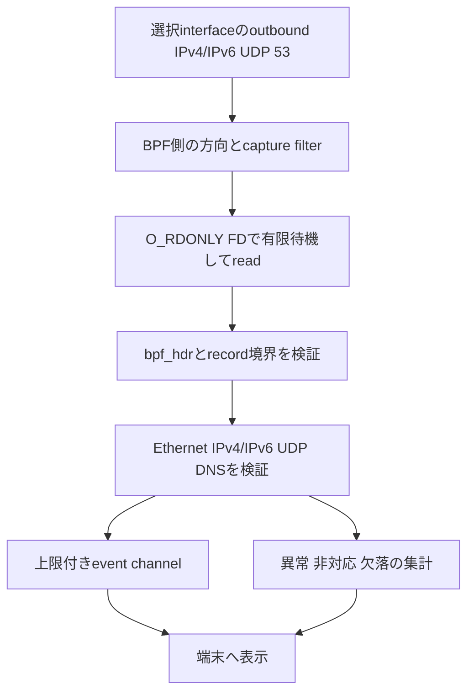

# veil-blackhole Phase 1 の設計

作成日：2026年10月6日 JST。状態：オフライン部分の実装と初期検証を完了。対象：macOSの読み取り専用DNSキャプチャとデコード。Liveバックエンド・権限処理を実装し、合成データの試験まで完了。利用者の実機出力で初期化・権限確認の通過、時間満了、Ctrl-C停止を確認。修正版では実DNSのread・デコードと時間満了も利用者の実機出力で確認した。現在の実装と試験結果は[VALIDATION.md](VALIDATION.md)と[LIVE_VALIDATION.md](LIVE_VALIDATION.md)を参照する。

**Phase 1は、選択したインターフェースで、自身のMacが送る平文IPv4/IPv6 UDP DNS queryを観測するツールとする。パケット送信、DNS応答合成、名前解決の変更、通信遮断は実装しない。** 対応していない入力や経路は、その制約を表示する。全DNSの観測、100%の安全、OSやNICへの無影響は保証しない。

## 1 提示仕様に必要な訂正

| 提示仕様 | 必要な訂正 |
| --- | --- |
| readするだけなら物理的・論理的に無影響 | readにもkernel処理と資源消費がある。取得準備のioctlはcapture状態を変更する。promiscuousはinterface状態を変える。OS・driver不具合のリスクも0とは言えない。 |
| sudoは通信を覗くためだけの権限 | rootは他の操作にも使える。プログラムが何を行わないかと、OSが許す能力は別。初期化後に降格し、失敗ならcaptureを始めない。 |
| pnetでRead-Only channelを作れる | 確認したpnet 0.35.0のmacOS channelはO_RDWR。senderを捨ててもFDはread-onlyにならない。厳密なO_RDONLY要件には標準channelを採用しない。 |
| promiscuousか自ホスト宛てならよい | 目的は自身が送信するqueryであり、受信や他端末の通信を広く取る必要はない。promiscuous/monitor modeを要求しない。 |
| Rust側で全packetから53番を抽出する | kernel capture filterで範囲を狭め、Rustでも再検証する。filter設定失敗で全packet captureへfallbackしない。 |
| BPF readの先頭はEthernet | 各packetの前にbpf_hdrがあり、一度のreadに複数recordが入る。header長とalignmentを処理してframeを取り出す。 |
| IPv4は20 bytesを読めばよい | IHLは可変。version、IHL、total length、fragment、protocolとcapture lengthを確認する。 |
| UDP header以降すべてがDNS | UDP lengthでpayloadを限定する。Ethernet paddingや余剰bytesをDNSへ渡さない。 |
| DNSのIDとflagsを読み飛ばす | QR、OPCODE、countを確認してqueryだけを扱う。name圧縮pointerと異常入力も処理する。 |
| libpcapがpnetとBPFのリンクに必須 | 確認した版ではlibpcapは必須ではない。BPFは「libpcapを加えるとリンクされるframework」という構造ではない。 |
| test-block.localで普通のDNSを試す | .localはmDNSの特別な名前で、UDP 5353など別経路になる。syntheticなtracker.testなどを使う。 |
| writeシステムコールを一切禁止 | 標準出力の表示にもwriteを使う。禁止対象はBPF FDへのwrite、raw送信、ネットワークへの応答・注入と明示する。 |

根拠は[Apple XNUのBPF実装](https://github.com/apple-oss-distributions/xnu/blob/f6217f891ac0bb64f3d375211650a4c1ff8ca1ea/bsd/net/bpf.c)、調査端末の`man 4 bpf`、[pnet 0.35.0のBPF backend](https://github.com/libpnet/libpnet/blob/v0.35.0/pnet_datalink/src/bpf.rs)、[同版Cargo.toml](https://docs.rs/crate/pnet_datalink/0.35.0/source/Cargo.toml)、[mDNS RFC 6762](https://www.rfc-editor.org/rfc/rfc6762.html)である。公開XNUの参照commitを調査端末のkernelそのものとは扱わない。

## 2 成功条件と観測範囲

成功条件は、指定したsynthetic queryについて、正しいQNAME・QTYPE・QCLASS・送信元/宛先を取り出し、実際の取得件数と欠落・非対応を区別し、無期限待機せず停止できることとする。

初版のlive入力はDLT_EN10MBのEthernet表現、タグなしIPv4/IPv6（IPv6拡張ヘッダーなし）、非断片化UDP、宛先port 53、QR=0、OPCODE=QUERY、QDCOUNT=1とする。方向は選択interfaceからのoutboundとし、取得開始時の自端末IPv4/IPv6送信元を確認する。通常のWi-Fiのデータリンク表現を対象にする場合も、DLTの確認を必須とし、802.11 monitor captureへ切り替えない。

以下は初版の観測範囲外とする。

- IPv6 extension/Fragment header/jumbogram、DNS over TCP、VLAN、IPv4 fragment、非Ethernet DLT。
- loopback、VPN等の別interface、別のDNS port、複数interfaceの同時取得。
- DoH・DoT、mDNS、独自resolver、cached name、固定IPの接続。
- アプリ名・プロセス・ユーザーの特定、TLS内容、DNS応答とのtransaction相関。

限定したIPv4/IPv6 UDPのアナライザを「Macの全DNSを解析する」と表現しない。BPFでHTTPSの暗号化されたpacketを取得できることと、そこからDoHのQNAMEが分かることは別である。ゼロ件の結果を、DNS利用の不存在やプライバシー保護の成功と解釈しない。

## 3 最小構成



単一Rustプロセスとし、capture workerがFDとread bufferを所有する。mainは端末表示と停止通知を担当する。初期化中だけ必要な権限を使い、capture loop・decoder・表示は降格後に動かす。初版にはTokioとratatuiを入れず、標準thread、bounded channel、シンプルなCLIで始める。

| モジュール | 責務 |
| --- | --- |
| main.rs | CLI、状態・カウンター・終了コード、停止通知 |
| bpf.rs | macOS限定のread-only FD、許可したioctl、有限poll/read、record解放 |
| privilege.rs | 起動権限の確認、呼出元identityの検証、降格と結果確認 |
| records.rs | BPF record境界、ABI・alignment、capture truncationの判定 |
| decode.rs | checkedなEthernet/IPv4/IPv6/UDP解析とDNS payloadの抽出 |
| dns.rs | 成熟した候補parserによるDNS query検証、表示用の名前のescape |
| event.rs | 上限付きの表示event、固定種類counter、drop数 |

`forge.rs`、sender、raw socket、応答バイト列の生成、DNS serverは作らない。pnet_packetのようなheader parserを使う場合は、datalink送信依存を持ち込まず、可変長・境界・fragmentの検証を利用側でも行う。

## 4 BPFの能力と初期化

### 4.1 開く能力

必要なら利用可能な`/dev/bpfN`を限定した探索回数で開き、`O_RDONLY | O_CLOEXEC | O_NONBLOCK`を要求する。O_RDWRへfallbackしない。成功後にaccess modeを照合し、read-onlyでなければ停止する。macOS以外では明示的なunsupportedを返す。

探索は初期案で最大128 deviceまでとし、権限不足と使用中を区別する。read bufferは初期案64 KiBを要求し、kernelが返す実buffer長を確認してから確保する。実長が妥当でない、または実装上限1 MiBを超える場合は停止する。これらは資源制限の提案で、全packetを欠落なく取得する保証ではない。

FDは`OwnedFd`等で一箇所に所有する。BPFへのwrite/send機能、汎用ioctlを外部へ公開する機能、後から別deviceをopenする機能を提供しない。unsafeなRust FFIはplatform.rsに、SDK構造とioctlはdarwin.cの小さい境界に閉じ込め、未整列pointerのdereferenceや長さを信用した構造体castをしない。

macOS backendは`libc`による小さいopen/ioctl/poll/readラッパーを第一候補とする。BPF ioctlの構造体・定数を`libc`がすべて提供すると仮定せず、使用するSDK headerとの対応を確認する。FDのaccess modeは`fcntl(F_GETFL)`と`O_ACCMODE`で照合する。

`O_RDONLY`が制限するのは、そのFDでの書込みである。capture用ioctlの状態変更、別FDのopen、processのfile access、OS/driver不具合まで禁止するものではない。「完全なRead-Onlyの数学的保証」や「process全体のsandbox」とは説明しない。read-only FD、送信APIを持たない型、限定ioctl、権限降格、入力検証を合わせて能力を絞る。

### 4.2 interfaceとfilter

interfaceはCLIで明示する。`en0`を既定に固定したり、最初にupなinterfaceを無条件で選んだりしない。候補一覧には名前・index・自端末address・up/loopback等を示すが、MACやIPはネットワーク情報として扱う。

初期化順は、対象の確認、device open、限定buffer設定、interface bind、DLT確認、outbound方向、限定filter、待機方法、read-only確認、権限降格、worker開始とする。captureの準備が途中まで進んで失敗したらFDを閉じて終了し、all-packet captureへ移行しない。

対象SDKにあるBPF ABIと定数を確認する。方向設定は`BIOCSDIRECTION`によるoutbound限定を候補とし、未対応・失敗なら対象外として停止する。送信packetを見えるようにする`BIOCSSEESENT`は送信能力の付与ではない。DLT_EN10MBで、タグなしIPv4、UDP、宛先port 53、fragmentなし、自端末送信元だけを通すcapture filterを設置し、Rust側でも同じ条件を照合する。

filterはIHLからUDPの位置を求め、固定20-byte offsetにしない。classic BPFのoffset、分岐、snaplenを独立したsynthetic入力で試験する。使用するbindingsは実際のSDK headerとlayoutを照合する。filter compileのためだけにlibpcapを追加する必要があるかは、手動の小さい固定filterと比較して判断する。

`BIOCPROMISC`、monitor mode、interface address/MTU変更、route/PF/DNS設定変更は禁止する。ただし他のcapture process等によりinterfaceが既にpromiscuousでも、自分が取得するpacketを送信方向とaddressで制限する。非promiscuous要求だけで他端末packetが絶対に見えないと保証しない。

interfaceのindex・address・up状態が変わった場合は停止して再選択を求める。別interfaceへ自動移動しない。自端末packetの判定は観測条件の限定であり、悪意あるlocal processのsource spoofingに対するidentity保証ではない。

### 4.3 権限

deviceにアクセスできる一般ユーザーなら昇格を要求しない。権限が不足している場合は明示的に失敗し、device全体のchmodやgroup変更を自動で行わない。build、依存取得、testをsudoで実行しない。

管理者で開始した場合、必要なopen/ioctlを完了してから、検証した呼出元の非root identityへsupplementary groups、GID、UIDを不可逆に降格する。順序・saved identity・結果の確認は対象OSのAPIで設計し、すべて成功しなければlive captureを開始しない。任意の環境変数だけを根拠に降格先を決めない。呼出元が特定できない直接root起動は初版では拒否する。

開いたread-only FDは降格後も読み取れることを実機で確認する。権限が必要な操作を後から再開するためにrootを保持したり、権限を戻すfallbackを作ったりしない。skeleton段階で降格が未実装なら、live entry pointはNotImplementedで終了し、TODOのままrootでcaptureし続けない。

現在の`privilege.rs`は降格手順の制御を担い、Darwin呼出しは`platform.rs`の`libc::initgroups`、`setgid`、`setuid`を使う。nixは採用していない。比較したAPIとして、確認した[nix 0.31.3のsetgid](https://docs.rs/nix/0.31.3/nix/unistd/fn.setgid.html)と[setuid](https://docs.rs/nix/0.31.3/nix/unistd/fn.setuid.html)は`user` featureを必要とする。依存を採用する際はversion・MSRV・license・advisoryを確認する。

降格はcapture workerを作る前の単一threadの初期化で行い、次の順序を守る。

1. 呼出元の非root UID、primary GID、account identityと対象を検証する。
2. 不要な継承FD・権限付きresourceを除き、必要なBPF設定を完了する。
3. Darwinの方式で呼出元の補助グループ状態を初期化する。
4. `setgid`、`setuid`の順で実行し、各errorを処理する。
5. `getgid`／`getegid`、`getuid`／`geteuid`が意図した非root identityと一致することを確認する。
6. すべて成立した結果だけをcapture開始処理へ渡す。失敗ならFDを閉じて終了する。

saved UID/GIDについては、調査端末の`man 2 setuid`にrootによる`setuid`／`setgid`がreal/effective/saved IDを設定する説明がある。対象OSでもこの契約を確認し、effective IDだけを変更するAPIへ置き換えない。`Ok(())`の確認だけで、グループ処理・呼出元の妥当性・降格後の状態まで確認済みとしない。

補助グループの処理はmacOS固有の確認項目である。確認した[nix 0.31.3のinitgroups](https://docs.rs/nix/0.31.3/nix/unistd/fn.initgroups.html)はAppleでは提供されない。Darwinの`libc::initgroups`等を狭いFFI境界で使う案を、実際のSDK・man page・directory serviceの意味と合わせて評価する。macOSでは`getgroups`が全membershipを表すとは限らないため、配列の一致だけで権限全体を証明しない。ここが未解決ならliveを無効のままにする。

権限降格後も、そのユーザーのfileや既に開いたFDへアクセスできる。権限降格をsandboxと呼ばず、process隔離が必要なら別の設計・検証として扱う。

## 5 BPF recordの解析

read bufferはABIが要求するalignmentを満たし、実際のread byte数だけを解析する。各recordについて、headerの必須fieldを安全に読み、`bh_hdrlen`、`bh_caplen`、`bh_datalen`を検証する。BPF headerのfieldはhost byte orderで、packet内のmulti-byte数値はnetwork byte orderである。

frame開始はrecord開始+`bh_hdrlen`、frame末尾はその開始+`bh_caplen`とする。加算はcheckedで行い、read済みbufferの範囲を超える入力はエラーとする。`bh_caplen > bh_datalen`等の不整合も拒否する。次recordは当該ABIの`BPF_WORDALIGN(bh_hdrlen + bh_caplen)`で進める。paddingと最後のrecordの終端を区別し、0-byte進行や無限loopを起こさない。

`bh_caplen < bh_datalen`はcapture truncationとして数える。初版は切詰めrecordを通常queryとして解析しない。BPFのdrop数、取得record数、packet解析失敗、DNS対象外、表示event欠落を別々に数える。filterで除外した全packetの種類・件数が分かるとは表示しない。

## 6 パケットのデコード契約

### 6.1 Ethernet

DLT_EN10MBかつ14 bytes以上のframeだけを解析する。MACとEtherTypeを境界内から読む。EtherType 0x0800以外は対象外。VLAN EtherTypeは初版では非対応とし、inner offsetを通常Ethernetとして誤解しない。

### 6.2 IPv4

version=4、IHLが5以上、header length=IHL×4 bytes、total lengthがheader以上でcapture範囲内であることを確認する。UDP開始はIHLから求める。IP optionsを含むheaderは、長さを守ってUDPへ進む。optionsの内容を解釈する機能は持たない。[RFC 791](https://www.rfc-editor.org/rfc/rfc791.html)

fragment offsetまたはMFが非zeroなら再構成せずunsupportedとする。DFのみは拒否条件にしない。protocol=17、送信元addressが開始時の自端末対象addressと一致することを確認し、total lengthを超えるEthernet paddingを除外する。

### 6.3 UDP

8 bytes以上で、UDP lengthが8以上かつIP payload内に収まることを確認する。初版は非断片化UDPの長さがIP payload長と一致することも確認する。source/destination portはbig endianで解釈し、destination=53だけを採用する。source=53はDNS応答等であり、今回のquery観測対象に含めない。[RFC 768](https://www.rfc-editor.org/rfc/rfc768.html)

IPv4/UDP checksumの状態は、capture位置とoffloadの影響を考慮する。独立した検算はsynthetic fixtureで行う。live captureのchecksumが未完成に見えることだけでpacketを破損と決めたり、checksum未確認を有効と表示したりしない。初版はliveでchecksumを検証済みとは表示しない。

### 6.4 DNS

DNS headerの12 bytes以上を要求し、QR=0、OPCODE=QUERY、QDCOUNT=1を確認する。ID、flags、QNAME、QTYPE、QCLASSを保持し、headerのcountとmessage構造をparserで検証する。初版はIN queryだけを表示対象とし、その他を非対応として集計する。

各label、root終端、QTYPE/QCLASS、pointerの参照先と循環、展開後の長さを確認する。63-byte label、255-byte wire nameなどの規格上限に加え、parser処理量を有限にする。questionだけ読んで残りが壊れていても正常queryとする実装を避ける。[RFC 1035](https://www.rfc-editor.org/rfc/rfc1035.html)、[RFC 9267](https://www.rfc-editor.org/rfc/rfc9267.html)

`dns-parser 0.8.0`等は候補であり、依存指定だけで保守・耐異常入力・現行DNS機能が確認されたことにはならない。[同版API](https://docs.rs/dns-parser/0.8.0/dns_parser/) 選ぶversionのcompression bounds、EDNS、未知RR、MSRV、license、advisoryを確認する。liveの信頼境界へ、学習目的の未検証自作parserをそのまま投入しない。自作を学ぶ場合はオフラインfixtureに限定する。

QNAMEは非UTF-8 labelやcontrol bytesを含み得る。表示には安全なescapeを用い、改行・ESC等をそのまま端末へ出さない。terminal escape injection、巨大な名前の繰り返し、任意のformat解釈を避ける。

## 7 表示とプライバシー

既定は名前を含まない集計表示とする。`--show-names`でQNAME、`--show-endpoints`でIP/port表示を選べる。live取得前に対象interface、取得範囲、表示する情報、有限の実行時間を提示する。syntheticなofflineデータでは名前を表示して解析を確認できる。

QNAME、endpoint、packet bytesを通常ログやfileへ保存しない。名前を表示するliveモードはTTYを必要とし、通常のfile redirectでは失敗させる。Phase 1にexport/pcap保存を入れない。terminalのscrollback、画面共有、OSや他アプリによる記録までは制御できないため、「表示だけなら情報が残らない」と保証しない。

eventは最大256件、画面の保持は直近200件までという暫定上限を設ける。表示が遅れたらeventをdropして欠落数を表示し、capture側の無期限blocking送信を避ける。QNAMEごとの永続mapや履歴は持たない。TUIを追加する場合も、終了・panic時のterminal mode復元、resize、日本語、keyboard、非TUI表示を検証する。

## 8 起動と停止

CLI案は`interfaces`、`replay --fixture PATH`、`capture --interface NAME --duration SECONDS`とする。現在は`replay`、help、Liveの`capture`を実装した。Liveの初期化・時間満了・Ctrl-C停止は利用者の実機出力で確認し、修正版では実DNSのread・デコードと時間満了も利用者の実機出力で確認した。`interfaces`は提供していない。引数なしではhelpを表示して終了し、liveへ自動移行しない。

liveの実行時間は必須とし、初期検証の例は60秒とする。無期限daemon、login起動、launchd登録は入れない。read待機はpoll等で最大100 msの暫定区切りを置き、stop flagを確認する。BPF read timeoutだけで無通信時に必ず終了できるとは仮定せず、実機でfiniteなpoll/readを確認する。

SIGINT/SIGTERM、時間上限、対象interfaceの変化、BPF I/O失敗、worker異常で停止する。受付を終了し、FDを所有workerで閉じ、thread joinと表示終了を確認する。join猶予は初期案2秒とし、停止を確認できなければ明示失敗とする。別threadから同じFDを強制closeする競合を作らない。

将来の状態表示案はStarting→Capturing→Stopping→Stoppedとする。現在のCLIはworker起動後のmode行と終了時の件数を表示する。CapturingはFD・filter・workerが準備できた状態であり、全DNS経路を観測できる意味ではない。skeletonが未実装の場合はStartingから未実装エラーで終了し、0件表示を続けて正常動作を装わない。

## 9 環境と依存の方針

対象はApple siliconのmacOSとする。調査端末は27.0.1 build 26A434 arm64だが、live captureは未試験である。実装開始時にSDK、最低OS、ABI、Rustと依存のMSRVを確認し、検証したRust数値versionとCargo.lockを固定する。

Nixは任意の開発経路として使える。採用するならflake.lockで入力を固定し、Rust toolchainと整合を取る。libpcapは選んだbackendやfilter compilerが実際に必要とする場合だけ追加する。NixでもOS/kernel/NIC/権限を固定できたとはしない。

初期依存はCLI、DNS parser、macOS ABI bindingsに必要なものへ絞る。将来のためだけにTokio、ratatui、libpcap、datalink senderを追加しない。buildとtestは一般ユーザーで実行し、Makefileでsudoを自動付与しない。

## 10 スケルトンと完成の境界

スケルトンは責務・型・エラー・停止経路を定義する足場であり、live captureの成功、安全性、正確なデコードの証拠ではない。TODOのcapture loopが空だったり、DNS parseが常にNoneを返したりする状態を「完成したアナライザ」と表示しない。

最初の成果物はofflineのrecord/frame/queryデコードと検証fixtureとする。live backendの未実装は明示エラーを返す。live実装の準備を終えても、利用者が取得対象と情報の表示を承認する前に実行しない。packet送信を実装しない範囲は、後段の研究を理由に拡張しない。

初回のオフラインスケルトンではBPF deviceをopenする実行経路自体を閉じた。現在はLiveバックエンド実装を承認されたため、この実行経路を追加しているが、初期化と停止の実機試験を実施したが、修正版では実DNSのread・デコードと時間満了も利用者の実機出力で確認した。以下は初回スケルトンの範囲を記録する。`capture`はdeviceアクセス前に`NotImplemented`で終了する。record decoderは人工bufferから、frame decoderは人工Ethernet frameから、DNS parserは人工DNS messageから、それぞれ独立に検証する。packet送信、query generator、実通信の採取でfixtureを生成するコードはこの成果物に入れない。

### 10.1 Fixtureの出所と期待値

人工的なfixtureは、説明付きの固定hex bytesまたは固定binaryとして用意する。testはネットワークを使わず同じ入力を再生し、期待値を構造体のfield単位で照合する。名前は`tracker.test`等とし、address・MACも試験用に選んだ値だけを使う。

| 種類 | 必須のmetadata | 位置づけ |
| --- | --- | --- |
| Synthetic fixture | 作成方法、各headerの境界、固定hex、期待するfieldまたはerror | 初期検証の標準入力。実通信を採取しない |
| Captured fixture | 採取の許可範囲、OS/interface/DLT、取得位置、切詰め・offload、匿名化と再計算の有無 | 必要になった場合の追加証拠。人工データとは呼ばない |
| 人工BPF record | 対象ABI、header長、alignment、caplen/datalen、frame bytes | record境界の試験。frame bytesと区別する |

Wireshark等で採取したpacketはcaptured fixtureである。画面にQNAMEが見えたことだけでは全headerやchecksumが正しいとは言えない。期待値はannotated bytesと独立decoderの結果を照合して固定する。採取データを加工した場合は、元の実通信と同一の条件ではないことを記録する。

異常系は正常fixtureを基準に一条件ずつ変更する。例えばIHLだけを変える試験では、意図したerrorに到達できるようtotal length・UDP位置などの他条件を整える。多箇所を壊して偶然errorが返るtestを、特定境界の検証として数えない。

## 11 検証と受入条件

| ID | 検証 | 受入条件 |
| --- | --- | --- |
| P01 | code/dependency/APIの点検、FD access mode | BPFへのwrite/raw send/応答合成機能なし。live FDはO_RDONLY。O_RDWR fallbackなし |
| P02 | 権限初期化・降格の成功と失敗 | decode前に非root。失敗・未実装ならcaptureを始めない |
| P03 | interface、方向、filter | 選んだ自端末outbound queryだけを対象とし、filter失敗なら停止 |
| P04 | 複数BPF record、短header、長さ不整合、alignment、truncation | 範囲外access、overflow、無限loopなし。切詰めを明示 |
| P05 | IPv4 IHL、options、total length、DF/MF/offset、UDP length | 可変offsetと境界が正しい。fragmentは非対応として処理 |
| P06 | DNS count、pointer loop、範囲外pointer、binary label、terminal escape | panic・過剰allocation・生のESC出力なし |
| P07 | fixtureのTCP/IPv6 extension/VLAN/response等 | 対象外を正常queryと誤認せず、制約を表示 |
| P08 | no-traffic時、traffic時のSIGINT/TERM・時間満了・I/O失敗 | finiteに停止し、FDとworkerを解放。停止失敗を隠さない |
| P09 | display stallと大量packet | memory/eventが無制限に増えず、BPFと表示のdropを区別 |
| P10 | privacy設定、redirect、synthetic秘密名 | 名前・endpointが通常file/logへ出ない。名前表示は明示・TTY限定 |

synthetic fixtureと独立decoderで解析の正しさを確認する。parserのencode/decode往復だけで合格にしない。fuzz対象はrecord/frame/DNS inputに限定し、時間とinput上限を決める。read-only保証のために実BPFへwriteを試す必要はなく、access modeと能力の点検で確認する。

権限処理のoffline試験では、各段階を失敗させたときcapture開始関数が一度も呼ばれないことを確認する。これはmockによる制御フローの検証であり、Darwinで降格した証拠ではない。実UID/GID・group処理・FD保持の確認は、別途承認された専用processで行う。test runner本体をroot化したり、そのidentityを変更したりしない。

live試験は承認されたinterface・時間・専用query generatorに限定する。アナライザ自体はqueryを送らない。試験用queryを送ることは別の操作として対象を明示する。実在の社内・機密名・悪性ドメインを試験に使わない。

観測数、generatorの送信数、BPF drop、解析失敗、表示drop、CPU、最大RSS、停止時間を記録する。performanceを測るときはOS/build/hardware、packet rate、corpus、buffer/filter、表示条件を添え、「µs〜ms程度」を実測値として先に決めない。

通常CIはoffline unit test、bounded fuzz、fmt/clippy/build、Markdown点検とする。macOS ABIのbuildとliveの実機試験を別の結果として扱う。通常CIにroot、live capture、OS設定変更を入れない。

## 12 貼り付け用の依頼文

以下はPhase 1のスケルトンを別途依頼する場合の完成形である。実装依頼を受けた際は適用文書のモデル選択・既存変更保全・承認範囲を確認する。

```text
veil-blackholeのPhase 1 Read-Only DNS Analyzerのスケルトンを作成してください。
docs/PHASE1_DESIGN.mdを現行仕様とし、docs/DESIGN.mdの送信・DNS server・
OS統合案は今回の実装対象にしないでください。

対象はmacOS Apple siliconで、選択interfaceのoutbound、タグなしEthernet表現、
IPv4、非断片化UDP、宛先53番の標準DNS queryです。
IPv6/TCP/VLAN/mDNS/DoH/DoT/cache/別interfaceは対象外と明記してください。

送信、応答合成、forge、raw socket、BPFへのwrite、PF、OS DNS・route変更、
promiscuous/monitor mode、常駐、公開は一切実装しないでください。
標準出力へのwriteは表示に必要なため、禁止するBPFへのwriteと区別してください。

実BPF FDはO_RDONLY、CLOEXEC、NONBLOCKで開き、O_RDWR fallbackは禁止です。
pnet 0.35.0の標準datalink channelをread-onlyと呼ばないでください。
macOSの薄いBPFラッパーはlibcを第一候補とし、SDK ABIを確認してください。
必要なSDK ABI/ioctlを確認し、kernel filterとRust再検証で取得範囲を限定します。
root初期化後の降格、有限待機、stop通知、FD所有・joinを型とerrorで表してください。
nixのsetgid/setuidはprivilege.rsに閉じ込め、group処理と実UID/GIDも確認します。
nixのinitgroupsがAppleで使えると仮定せず、Darwin側の方式を確認してください。
この部分が未実装ならlive entry pointを明示的なNotImplementedで終了させます。
最初のスケルトンではdevice openより前にNotImplementedで終了してください。

BPF record header/長さ/alignmentを剥がしてからframeを解析してください。
IPv4はIHL、total length、fragmentを、UDPはlengthとportを検証します。
DNSはQR/OPCODE/count、圧縮名pointer、message境界を検証するparserを選び、
QNAMEのcontrol bytesをescapeして表示します。実名・endpointは明示表示にし、
既定のquery log・pcap保存・exportはありません。

まずoffline synthetic fixtureでP01〜P10のうち確認可能な部分を検証してください。
固定hex bytes、header境界、期待するfield/errorと独立decoderの確認を残します。
実通信から採取したデータをsyntheticと呼ばず、まず人工データを使ってください。
live未検証を明記し、実packetのcaptureや試験queryの送信を勝手に実行しないでください。
依存とtoolchainは一次資料で選定・固定し、不要なTokio/ratatui/libpcapを追加しません。
安全性100%、完璧な解析、Mac全DNSの観測を保証する説明は書かないでください。
```

## 13 研究としての終了条件

このPhase 1が検証する問いは、限定した自端末queryを正しく、安全条件を守って観測できるかである。fixture解析、read-only能力、降格、取得対象、停止が成立し、対象条件で観測結果を記録したら研究の一区切りとする。

権限降格・限定filter・停止を成立させられない場合はliveを無効のまま止め、機能を緩めて継続しない。別経路や送信研究、Network Extension、B2B製品化は新しい範囲として判断する。Phase 1の技術成功だけで製品価値・支払意思・全通信の安全性が実証されたとはしない。

## IPv6追加仕様

2026年10月6日、既存DNS resolverへの接続に必要なIPv6対応を承認し、基本header直後のUDPに限定して追加した。payload length、capture length、UDP lengthを検証し、extension/Fragment headerとjumbogramは対象外。自端末source照合は128 bit全体で行い、IPv4/IPv6 addressは合計最大16件。snaplenは最大65589 byte。詳細と現在の試験結果は[IPV6_VALIDATION.md](IPV6_VALIDATION.md)を参照する。本文中の初回skeleton用依頼は過去のIPv4限定範囲であり、現在の実装指示として再利用する場合はこの追加仕様を含める。
